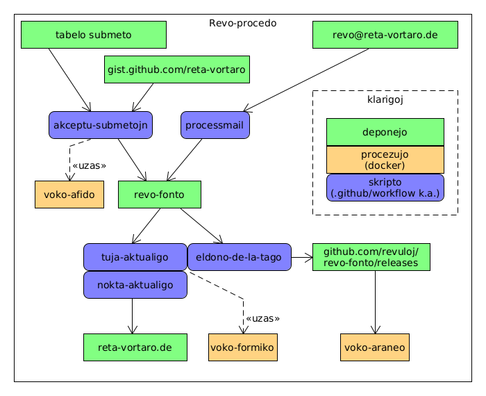

# voko-formiko
La transformilo de Reta Vortaro, baziĝanta sur Apache Ant + Java.

*Pri la nomo*: formikoj estas malgrandaj kaj tre lertaj konstruantoj de formikejoj. La 
maniero kiel la tansformilo helpe de multaj unuopaj reguloj konstruadas la
stakon de tuta vortaro kun ĉiuj indeksoj el la fontoj de la artikoloj iom similas
la laboron de la diligenta popolo de fomikoj. 
Cetere la programo uzata por stiri la tutan procedon nomiĝas "Ant", do Formiko.

## Funkciado de la redaktoservo

La funkcion de la redaktoservo ilustras la sekva diagramo. Redaktoj povas veni per unu el tri vojoj. La malnova ebleco estas per ordinara retpoŝto. La du pli novaj eblecoj estas submetoj: a) per aparta datumbazo - tiun ni uzas kun la enkonstruita redaktilo ĉe [reta-voraro.de](https://reta-voraro.de) - kaj b) tra la retpaĝo [gist.github.com](https://gist.github.com/reta-vortaro) - tion uzas la aparta redaktilo Cetonio ĉe [revaj.steloj.de](https://revaj.steloj.de/).

Krome por teĥnikaj celoj oni ankau povas puŝi rekte al la deponejo de revo-fonto, sed necesas skripte altigi la eldonon de artikolo kune kun aŭtomatigitaj ŝangoj. Ni uzas tion ekzemple por unufoja aŭtomata aldonado de tradukoj de nova lingvo.



En la retejo de [revo-fonto](https://github.com/revuloj/revo-fonto/actions) regule lanciĝas skriptoj por trakti alvenantajn redaktojn. Tiel ni traktas submetojn per ago `akceptu-submetojn`. La ordinarajn retpoŝtojn ni devas ankoraŭ trakti per skripto `processmail.pl` en aparta servilo. Ĝi poste puŝas la ŝanĝojn post kontrolo en la git-deponejon.

La diversaj Perlo-skriptoj kiuj akceptas retpoŝte kaj submete disponigitajn redaktojn, troviĝas en 
procezujo [voko-afido](https://github.com/revuloj/voko-afido).

Post kiam la ŝangitaj artikoloj troviĝas arĥivitaj kiel nova eldono en la deponejo, ili traktiĝas per ci-procezujo voko-formiko: rekreiĝas retpaĝo kaj historio kaj sendiĝas la la publika servilo.

La indeksoj rekreiĝas ĉiunokte, do malpli ofte, same per voko-formiko. Krome ĉiutage ni pakas eldonon de la retpaĝoj, datumbazon kaj dict-dosierojn por elŝutado.

## Kiel krei novan eldonon

La centraj dosieroj (agordo, DTD, XSL) estas en [voko-grundo](https://github.com/revuloj/voko-grundo). Do antaŭ nova eldono de voko-formiko kutime necesas pretigi novan eldonon de voko-grundo.

Poste helpas la skripto bin/eldono.sh por organizi la novan eldonon. Eldono kreiĝas en sia aparta git-branĉo, kiun vi kreas komence. Eldonojn ni nomas cifero+litero, ekzemple `2f`, sed malsupre montras per ĵokero `<ELD>`.
Jen konciza paŝaro:

```
# krei kaj eniri novan git-branĉon
git checkout -b <ELD>

# prepari la eldonon, skribante la nomon supre en la helpskripton
vi bin/eldono.sh
release=<ELD>

bin/eldono.sh preparo

# nun faru ĉiujn bezonatajn ŝanĝojn en la kodo. Novan procezujon `voko-formiko` vi povas krei loke per
bin/eldono.sh kreo

# Tiun vi povas uzi kune kun aliaj en revo-medioj/formiko-testo 
# aŭ revo-medioj/formikujo kaj do elprovi izolite

# konfirmu kaj puŝu viajn ŝanĝojn
git add <dosieroj>
git commit -m"<kion vi ŝanĝis>"
git push --set-upstream origin <ELD>

# donu aŭ ŝovu etikedon <ELD> al la nuna stato de la kodo,
# tio puŝas la etikedon ankaŭ al github kaj tie kreiĝas nova procezujo kun tiu etikedo
bin/eldono.sh etikedo

# Fine, kiam vi ne plu faras ŝanĝojn en la eldono vi povas movi ĉion al la ĉefa branĉo, etikedi la eldonon tie 
# kaj forigi la flankan branĉon
git checkout master
git merge <ELD>
git tag v<ELD>
git push --tags
git -d <ELD>


